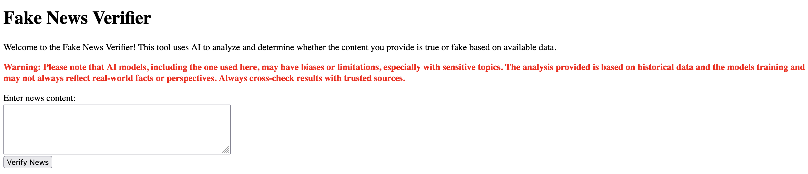

# Fake News Verifier - Docker Setup

This is a Ruby on Rails application to verify news content using OpenAI's GPT model. This project utilizes Docker for containerization making it easy to run in any environment.

## 🚀 Quick Start with Docker

### Clone the Repository 

- ```git clone https://github.com/yourusername/fake-news-verifier.git cd fake-news-verifier```
- Create file .env file in the root directory and add your OpenAI API key: `OPENAI_API_KEY=your_openai_api_key_here` 
- Start the Application with Docker Launch the application with: ```docker compose up --build```

## Prompt mechanism 
Try different types of news content (e.g., political, scientific, health-related) and check how the results vary. Based on the model’s performance, you may want to adjust the templates and improve the prompts further.

## Maximizing the Effectiveness of the Fake News Verifier
The Fake News Verifier leverages advanced AI prompt engineering to enhance the accuracy and relevance of its results. Here’s how you can get the best out of the prompt mechanism:

1. Provide Clear and Concise News Content
To get the most accurate result, ensure that the news content you enter is clear and complete. Avoid ambiguous language or incomplete articles, as the AI may not be able to provide a comprehensive analysis based on unclear inputs.

Tip: If possible, provide the full text of the article to help the model assess it thoroughly.
2. Use Keywords for Specific Content Types
The system uses specific prompts depending on the type of news content. For example:

For scientific or health-related content: The prompt focuses on the accuracy of the data and potential scientific biases.

For political news: The prompt evaluates the accuracy and political bias of the content.

Tip: If your news article involves topics like science, health, or politics, try to include keywords related to those themes in your input to trigger the most relevant prompt template.

3. Expect Transparency in Results
The app provides not only a True or Fake verdict but also an explanation of why the content is deemed true or fake. It also highlights biases and limitations the model might have detected in the content, offering users insight into how the model arrived at its conclusion.

Tip: Read the full explanation and bias notice provided in the result to understand the model’s reasoning better.
4. Understand the Model’s Limitations
AI models, including the one used by Fake News Verifier, can sometimes have limitations or biases, especially when analyzing sensitive or controversial topics. Always cross-check results with other reliable sources.

Tip: The app provides a warning about potential biases, so always consider that the AI is one tool in a broader fact-checking process. The AI analysis is based on the data available up to its last training date and may not account for recent developments or perspectives.
5. Review the Categories of Content
Certain types of content, like political or health-related articles, will trigger more specific analysis templates. The system checks for potential biases and evaluates the credibility of sources, providing more context about why certain content is flagged.

Tip: If you notice that the result seems uncertain, try to refine or adjust the content to be more specific and context-rich. AI can work better when provided with well-defined inputs.
6. Use the App Multiple Times for Complex Queries
If your content is particularly complex or involves multiple topics (e.g., combining politics with health), feel free to run the verification multiple times, focusing on different sections or angles of the content.

Tip: You can break down long articles into smaller sections and verify them separately to get more precise feedback on different aspects of the content.

